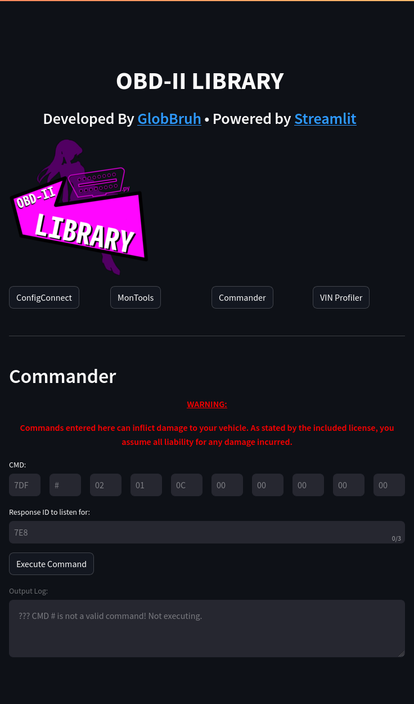

# OBDIITerm

OBD-II Python Library for Linux


Proof of concept OBD-II interfacing tool, featuring a interactive terminal and GUI (powered by Streamlit). Built in python3.

> [!WARNING]  
> No warranty or liability, use at your own risk.

> [!IMPORTANT]  
> This tool is unfinished. Expect bugs or missing features. 

## Setup:

### CLI:

1) Install the [`python-can`](https://pypi.org/project/python-can/) dependency.
2) Run `obd2_Base`.

All other dependencies used in `obd2_Base` should already be included with a default python install.

### GUI:

<table><tr>
<td></td>
<td></td>
</tr></table>

1) Install [Streamlit](https://docs.streamlit.io/get-started/installation).
2) Perform CLI install.

The GUI can be ran with the following command:
```
[path to Streamlit executable] run obd2_GUI.py
```

### Use in a script:

1) Add the following line to the imports in your script: 
    ```py
    import obd2_Base as gDiags
    ``` 
Browse to [functions documentation](docs/functions.md) for usage. 


## License:

This project is licensed under [The 3-Clause BSD License](https://opensource.org/license/bsd-3-clause).