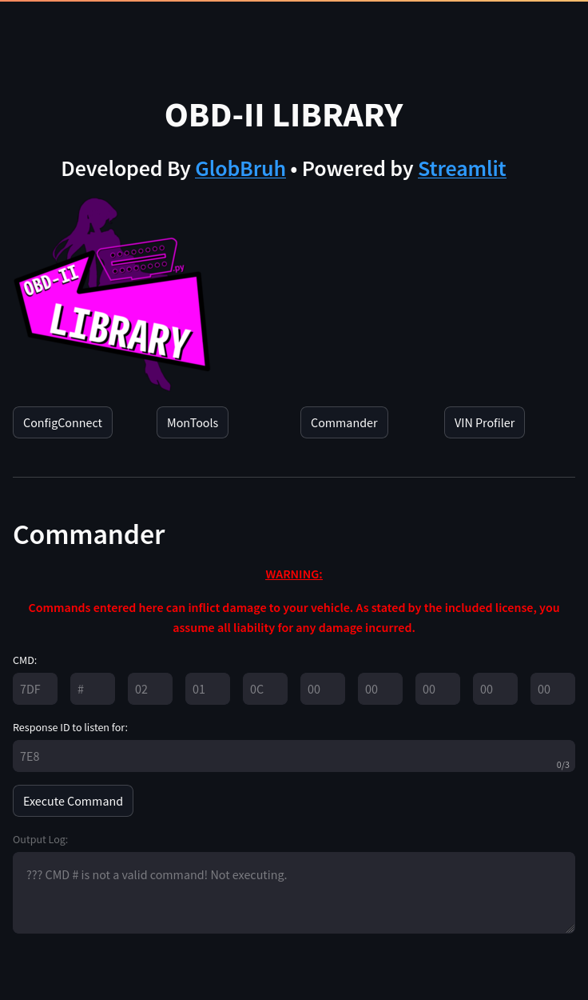
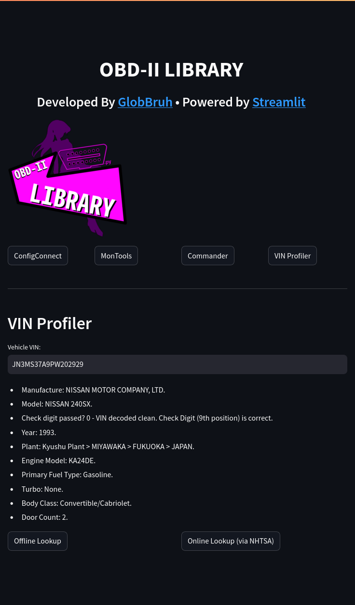

## How to use the GUI:

<table>
<tr>
<td></td>
<td></td>
</tr>
</table>

<table>
<tr><th>Tab</th><th>What does it do?</th></tr>

<tr><td><pre>ConfigConnect</pre></td><td><pre>
ConfigConnect is a tool to configure your OBD-II cable with your computer/Python.
</pre></td></tr>

<tr><td><pre>MonTools</pre></td><td><pre>
MonTools is a set of tools designed to get realtime information about the vehicle.
</pre></td></tr>

<tr><td><pre>Commander</pre></td><td><pre>
The Commander will let you send custom CAN commands. Use at your own risk!
</pre></td></tr>

<tr><td><pre>VIN Profiler</pre></td><td><pre>
The VIN Profiler will lookup VIN numbers. 
</pre></td></tr>

</table>